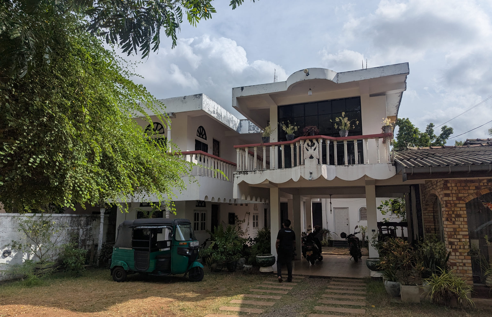

# Pahan Guest

Static marketing site for a three-room guesthouse in Anuradhapura, Sri Lanka.
Implemented from the `Kadju House.dc.html` artboard in the *Kadju House website design*
Claude Design project (which also holds the `BookingForm` component it imports).
The design was drawn for a fictional south-coast guesthouse; the brand and all
location copy have since been moved to Pahan Guest in Anuradhapura.

No build step, no dependencies. Open `index.html`, or serve the folder:

```sh
npx serve .          # or: python -m http.server
```

## Deploying to Vercel

The repo is already set up for it — no config needed beyond what's committed.

**Via the dashboard:** push this repo to GitHub, then
[import it on Vercel](https://vercel.com/new). It has no `package.json`, so
Vercel auto-detects it as a static site (Framework Preset: "Other") and
deploys the repo root as-is — no build command, no output directory to set.

**Via the CLI**, from this folder:

```sh
npx vercel        # first deploy — follow the prompts, links the project
npx vercel --prod # promote to production
```

Two things already handled:

- **`.gitignore`** excludes `Guest house images/` (120MB of raw originals —
  the site only ever uses the processed copies in `assets/img/`, ~5.5MB
  total) and `.claude/`, which aren't part of the site.
- **`vercel.json`** sets a day-long cache on `assets/img/*` (the filenames
  aren't content-hashed, so nothing longer — replacing a photo under the
  same name should still reach visitors reasonably soon) plus baseline
  `X-Content-Type-Options` / `Referrer-Policy` headers. No rewrites are
  needed: routing is client-side hash fragments (`#/room/garden-room`), so
  every URL Vercel ever serves is just `index.html`.

## Files

```
index.html              markup for both screens, overlays, and the booking-form template
assets/css/styles.css   design tokens + all styling
assets/js/app.js        booking form, overlays, gallery, scroll chrome, routing
```

## Configuration

The WhatsApp number and the house name are read from `<body>` — change them in one place:

```html
<body data-phone="94772813748" data-house="Pahan Guest">
```

`data-phone` is in international format with no `+` or spaces (what `wa.me` expects).
The phone number also appears literally in the `tel:` links, the footer, the mobile menu
and the JSON-LD block; search for `94772813748` to catch all of them.

## Still to replace

Copy inherited from the design template that describes a business that does not exist:

- **Reviews** — every quote and name in the reviews section is invented (there's no
  Google Business or Booking.com listing yet, and no review-collection system in place).
  They're deliberately *not* attributed to a platform and don't link out to one, per the
  owner's request — swap in real quotes as they come in, or delete the section. The hero's
  rating line and the reviews header use an honest stand-in ("usually booked full, most
  months") instead of a fabricated score; the JSON-LD `aggregateRating` was removed and the
  schema `@type` changed from `BedAndBreakfast` to `GuestHouse` for the same reason.
- **Hosts** — "Nadeeka & Sunil Fernando" are invented names.
- **Address and phone are real**, from the owner's flyer: No. 1050, Stage 2, D. S. Senanayake
  Mawatha, Anuradhapura, and `+94 77 281 3748`. Postcode 50000 and North Central Province were
  inferred (correct for Anuradhapura) and not on the flyer — worth confirming.
- **Email is still a placeholder** — `reservations@pahanguest.lk` — no real address was given.
- **Prices** — US$42 / US$55 / US$78 are from the template.
- **Distances** — the times to Sri Maha Bodhi, Ruwanwelisaya, Mihintale, Isurumuniya and
  Nuwara Wewa are plausible for a town guesthouse but depend on where the house actually is.

Room copy, prices and the collage captions live at the top of `assets/js/app.js`
(`ROOMS`, `PHOTOS`). Room prices are also written into the cards in `index.html`.
The gallery is the collage described below — six photos, no filter grid.

## Photography

The gallery collage uses real photographs of the house, in `assets/img/`. Each is
pre-cropped to its slot's exact aspect ratio and resized for the largest size it reaches
during the zoom (the centre photo at 2400px, the rest 1100–1800px) — about 2 MB for all six.
Originals are in `Guest house images/`.

| slot | file | shows |
| --- | --- | --- |
| 1 | `house-garden.jpg` | the house across the lawn, tuk-tuk by the verandah |
| 2 | `balcony.jpg` | upstairs balcony, balusters, mango tree |
| 3 (centre) | `house-front.jpg` | front of the house framed by the tree |
| 4 | `room-beds.jpg` | guest room, double and single bed |
| 5 | `dining.jpg` | dining room under the ceiling fan |
| 6 | `entrance-path.jpg` | stepping stones to the front steps |

Everything else on the site is still a striped placeholder. The `data-shot` attribute on each one is the brief
for that frame and renders as caption text while the placeholder is in place:

```html
<div class="ph ph--3x4" data-shot="front of the white two-storey house at golden hour"></div>
```

To drop in a real photo, replace the element and keep the aspect-ratio class off:

```html

```

## The hero slideshow

The hero is a crossfading photo slideshow, not a video — four real photos in
`#heroSlideshow` (`assets/img/hero-1.jpg` … `hero-4.jpg`), each a stacked
full-bleed ``. `app.js` toggles `.is-on` on the next slide every 5s
(`SLIDE_MS`); the fade itself is a CSS `opacity` transition on `.hero__slide`.

- Pauses when the tab is hidden (`visibilitychange`), so a background tab
  doesn't burn through slides unseen, and resumes when it's visible again.
- The existing "Pause slideshow" button stops/resumes it — same control the
  design used for a video, relabelled.
- Doesn't auto-advance at all under `prefers-reduced-motion` — it stays on
  the first slide unless the visitor manually pauses/plays.
- The first slide loads `fetchpriority="high"` with no `loading` attribute
  (it's the LCP candidate); the other three are `loading="lazy"`.

To add or replace slides, add another `` inside
`#heroSlideshow` and nothing else needs to change — `slides.length` is read
from the DOM. Each source photo was resized to 2400×1500 (`fit: cover`) since
the CSS already applies `object-fit: cover`, so browser-side cropping handles
every viewport; there was no need to hand-crop per aspect ratio the way the
gallery collage's fixed slots required.

If you'd rather use a real video clip here instead, swap `#heroSlideshow` for
a single `<video class="hero__video" autoplay muted loop playsinline poster="…">`
— the CSS rule for `.hero__video` still exists in `styles.css` for that path,
and `assets/video/` is on `.gitignore`-free by default if you add files there.

## How this differs from the artboard

The canvas file is a design surface; four things were translated rather than copied:

- **Responsive switching.** The artboard drove its wide/narrow layouts from a JS
  `window.innerWidth <= 820` flag. That is a CSS `@media (max-width: 820px)` block here,
  so the first paint is already correct and the layout survives with JS off.
- **Scroll work.** The artboard polled on `requestAnimationFrame` for the life of the page.
  Reveals, counters and the SVG draw-on now use `IntersectionObserver`; the header, hero
  parallax and floating buttons use a rAF-throttled scroll listener.
- **The room screen is addressable.** It was a `screen` state flag; it is now
  `#/room/garden-room`, so room pages can be linked and the browser Back button works.
  Returning to the home screen restores your place in the page instead of jumping to the top.
- **Accessibility.** Gallery photos are real buttons rather than click handlers on `<figure>`;
  the FAQ uses `aria-expanded`/`aria-controls`; the three overlays trap focus, lock scroll and
  restore focus on close; form errors are wired up with `aria-describedby`.

Colours, type scale and spacing are unchanged from the design.

## The gallery collage

The gallery opens with a pinned zoom collage, rebuilt from the "scale grid" section on
discoverybuildersllc.com. `.sg` is a 400vh runway, `.sg__wrap` sticks to the viewport for its
whole length, and scroll progress drives three things at once:

| | start | end |
| --- | --- | --- |
| `.sg__content` (the whole canvas) | `scale(1)` | `scale(cover)` — reference photo fills the screen |
| reference photo inside its frame | `scale(1.5)` | `scale(1)` |
| the other five photos | `scale(1)`, opaque | `scale(0.75)`, transparent |

The counter-zoom on the reference is the detail that makes it work: the frame travels a long
way while the picture inside barely magnifies.

Geometry is `em` against a viewport-derived font size, so the canvas is fluid. The original
sets `html { font-size: calc(9 * 100vw / 1600) }` globally; this site keeps its own root size
and puts that ratio on `.sg__wrap` instead, so nothing else is affected. The six slot positions
are the source's, unchanged.

Two deliberate differences from the original:

- **No GSAP.** The source uses GSAP + ScrollTrigger with `scrub: true` and `ease: 'power1.inOut'`.
  A scrubbed timeline is a linear mapping from scroll progress to a number, so it is a few lines
  of arithmetic here — `power1.inOut` is quadratic in-out, reproduced exactly — rather than a
  70 KB dependency on a site that otherwise ships none.
- **Cover semantics for the target scale.** The source computes
  `ww > wh ? ww / refWidth : wh / refHeight`, which picks its axis by which side of the *window*
  is longer rather than by which one actually covers. On a squarish display (1280×1024) that
  ends about 200px short and the page background shows above and below the photo. This uses
  `Math.max(ww / refWidth, wh / refHeight)` — identical on 16:9 and 16:10, correct everywhere else.

Below 821px the whole effect is off: no runway, no pinning, and only the reference photo renders,
as a normal 16:10 block. Under `prefers-reduced-motion` it becomes a still picture of the same
collage — laid out, unpinned, no zoom. Each photo opens the lightbox; `PHOTOS` in `app.js` is indexed to match the six slots.

To tune the scroll length, change `--sg-runway` (default `400vh`) on `.sg`.

## Motion

All timing lives in the tokens at the top of `styles.css`. The rules behind them:

- **One curve.** `--ease: cubic-bezier(0.22, 1, 0.36, 1)` is the design's own, and it is
  already a strong ease-out, so it covers entrances and feedback. `--ease-drawer` is the
  iOS-style curve for the bottom sheet. `linear` is used only for the review marquee, where
  the motion is constant. Nothing uses `ease-in` — it withholds movement at the exact moment
  the user is watching, which reads as lag.
- **Entry and exit are asymmetric.** Overlays come in over `--t-enter` (320ms) and leave over
  `--t-exit` (200ms). Deciding is slow, responding is fast.
- **Overlays animate in both directions.** Each carries its closed state on the base class and
  its open state on `.is-open`, so the same transition runs in reverse and can be interrupted
  mid-flight — reopening the lightbox while it is fading out cancels the pending removal
  rather than restarting from zero. JS sets `[hidden]` only once the exit has played, and a
  closed overlay is `pointer-events: none` so it cannot swallow clicks while invisible.
- **The sheet leaves the way it arrived**, by `translateY(100%)` — its own height, whatever the
  content — so it reads as one object sliding rather than a box fading.
- **Every control answers the press** with `scale(var(--press))` in 140ms. Full-width accordion
  rows and inline text links are excluded, where shrinking the row reads as a glitch.
- **Hover is gated** behind `@media (hover: hover) and (pointer: fine)`. Without it a tap fires
  `:hover` and leaves the photo stuck at 1.04.
- **Reduced motion means gentler, not none.** Opacity and colour still transition (they carry
  meaning — that an overlay arrived, that a field is invalid); everything that moves is dropped,
  including the press scale and the header's slide-away.

Two performance notes: only `transform` and `opacity` are transitioned on anything that runs
during scroll, and the hero's corner radius — the one property there that forces a repaint of a
full-viewport layer — is quantised to whole pixels, so it repaints about twenty times across the
hero instead of once per frame.
